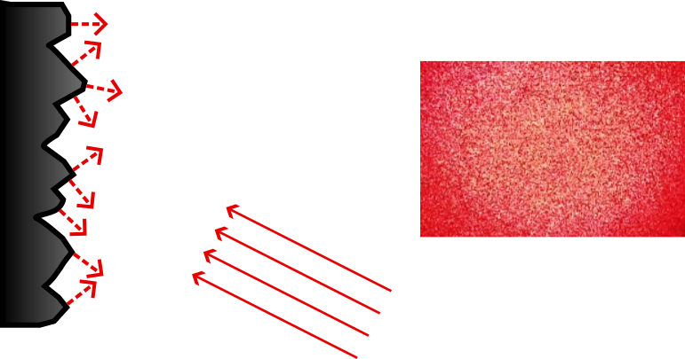
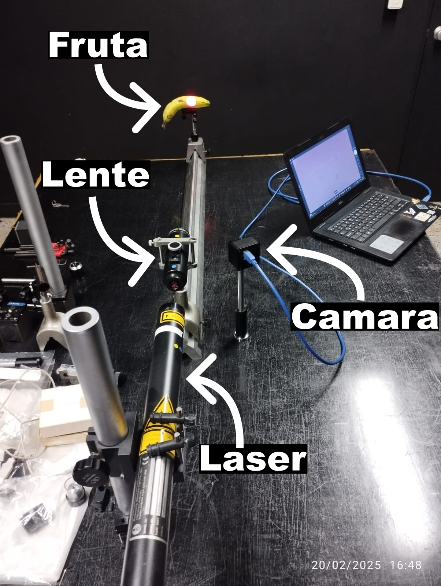
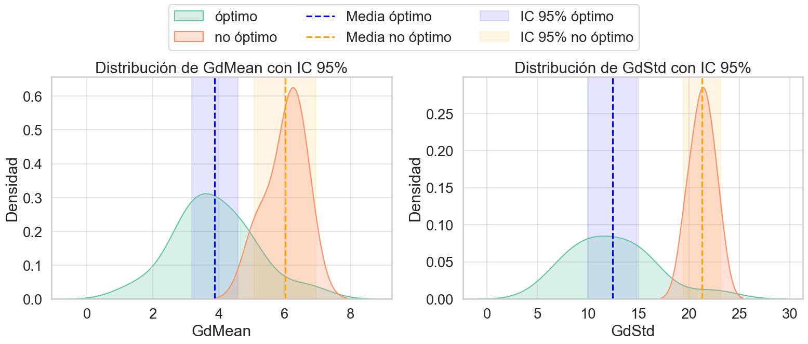
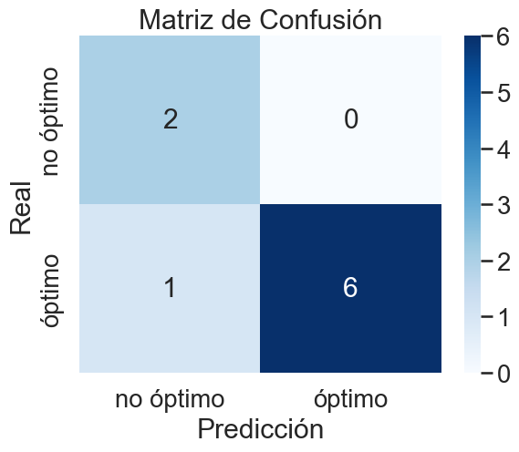

# 🫐 Biospeckle-ML: Clasificación de Arándanos mediante Análisis de Biospeckle

<div align="center">



**Análisis de patrones de biospeckle para la clasificación de calidad en arándanos**

[](LICENSE)
[](https://python.org)
[](https://isocpp.org)
[](https://opencv.org)
[](https://pytorch.org)

</div>

## Descripción

Este proyecto implementa un sistema de clasificación automática de arándanos basado en el análisis de patrones de **biospeckle**. El biospeckle es un fenómeno óptico que ocurre cuando la luz láser coherente incide sobre superficies biológicas activas, generando patrones dinámicos que contienen información sobre la actividad celular y la calidad del producto.

### Objetivo

Desarrollar un clasificador que pueda distinguir entre arándanos **óptimos** y **no óptimos** para el consumo, utilizando técnicas de procesamiento de imágenes, análisis estadístico y machine learning.

## Fundamentos Científicos

### Biospeckle
El **speckle** es un patrón de interferencia generado por luz coherente reflejada en superficies rugosas. En tejidos biológicos, este patrón varía con el tiempo (**biospeckle**) debido al movimiento microscópico de las células, orgánulos y fluidos.



### Metodología de Análisis

1. **THSP (Time History Speckle Pattern)**: Análisis temporal de los patrones de speckle
2. **Matriz de Co-ocurrencia**: Análisis estadístico de la distribución espacial
3. **Momento de Inercia (MI)**: Medida de la dispersión en la matriz de co-ocurrencia
4. **Diferencias Generalizadas (GD)**: Análisis de las variaciones temporales

## Arquitectura del Proyecto

```
📦 Biospeckle-ML/
├── 📁 src/
│   ├── 📁 cpp/                    # Procesamiento de videos (C++)
│   │   ├── main.cpp              # Algoritmos de biospeckle
│   │   └── preview.cpp           # Visualización
│   └── 📁 python/
│       └── 📁 notebooks/         # Análisis y clasificación
│           ├── ProyectoBiospeckle.ipynb    # Análisis estadístico principal
│           └── ClasificadorPyTorch.ipynb   # Red neuronal PyTorch
├── 📁 data/
│   ├── 📁 raw/                   # Videos originales (.mp4)
│   └── 📁 processed/             # Características extraídas (.csv)
├── 📁 models/                    # Modelos entrenados (.pth)
├── 📁 output/figures/            # Visualizaciones generadas
└── 📁 docs/presentacion/         # Documentación científica
```

## Flujo de Procesamiento

### 1. **Preprocesamiento (C++)**
```bash
# Compilar módulo C++
cd src/cpp
g++ -o main main.cpp `pkg-config --cflags --libs opencv4`
./main
```

El módulo C++ procesa videos de arándanos y extrae:
- Patrones THSP
- Matrices de co-ocurrencia
- Cálculos de momento de inercia
- Diferencias generalizadas

### 2. **Análisis Estadístico (Python)**


Variables clave identificadas:
- **GdMean**: Media de las diferencias generalizadas
- **GdStd**: Desviación estándar de las diferencias generalizadas

### 3. **Clasificación con Machine Learning**

#### Modelo Tradicional (sklearn)
- **Algoritmo**: Regresión Logística
- **Precisión**: 89%
- **Características**: GdMean + GdStd

#### Modelo Avanzado (PyTorch)
- **Arquitectura**: Red Neuronal Feedforward
- **Capas**: 2 → 16 → 8 → 1 (con Dropout y ReLU)
- **Precisión**: 100%
- **Regularización**: Dropout (20%) + Weight Decay



## 📊 Resultados

### Análisis Estadístico
| Variable | p-valor (t-test) | Distinguibles? | IC 95% óptimo |
|----------|------------------|----------------|---------------|
| GdMean   | 0.0042          |  Sí          | [3.2, 4.6]    |
| GdStd    | 0.00078         |  Sí          | [10, 15]      |
| MI       | 0.064           |  No          | [3.3e+06, 7e+06] |

### Rendimiento de Modelos
- **Regresión Logística**: 89% de precisión
- **Red Neuronal PyTorch**: 100% de precisión
- **Mejora relativa**: +12.4%

## Instalación y Uso

### Uso Rápido

1. **Procesar videos de arándanos**:
```bash
cd src/cpp
./main input_video.mp4
```

2. **Análisis estadístico**:
```python
# Abrir ProyectoBiospeckle.ipynb
jupyter notebook src/python/notebooks/ProyectoBiospeckle.ipynb
```

3. **Entrenamiento del clasificador**:
```python
# Abrir ClasificadorPyTorch.ipynb
jupyter notebook src/python/notebooks/ClasificadorPyTorch.ipynb
```

## Dataset

- **Total de muestras**: 18 arándanos reales + datos sintéticos aumentados
- **Distribución**: 14 óptimos, 4 no óptimos
- **Características**: GdMean, GdStd, MI, índices de Fujii
- **Formato**: Videos MP4 → Características numéricas CSV

### Métodos Implementados
- **THSP**: Time History Speckle Pattern analysis
- **Matriz de Co-ocurrencia**: Análisis de textura estadística
- **Diferencias Generalizadas**: Cuantificación de actividad biológica

### Aplicaciones
- Control de calidad en industria alimentaria
- Análisis no destructivo de productos biológicos
- Monitoreo de actividad celular en tiempo real

## 👥 Contribuidores

- **Laura Velásquez** - Análisis experimental y metodología
- **Juan Montoya** - Implementación computacional y machine learning

**Institución**: Facultad de Ciencias Exactas y Naturales, Universidad de Antioquia (FCEN@UdeA)

- 📍 Ubicación: Medellín, Colombia
